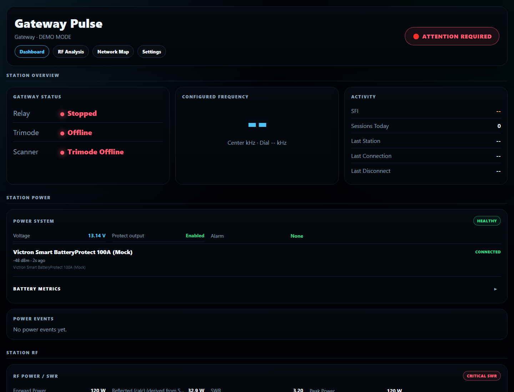
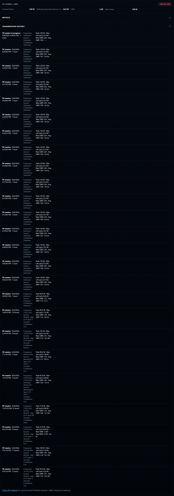
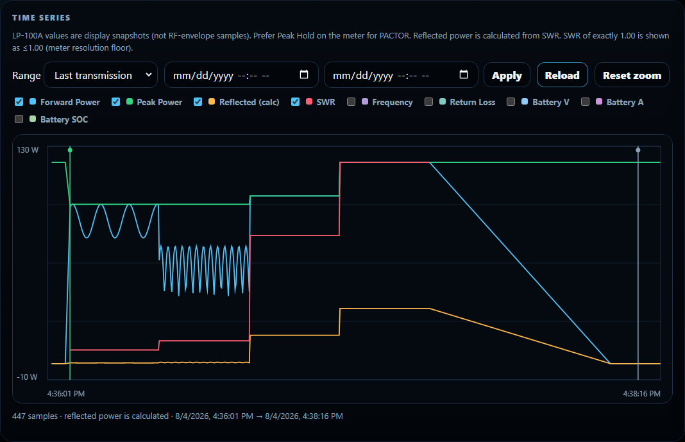
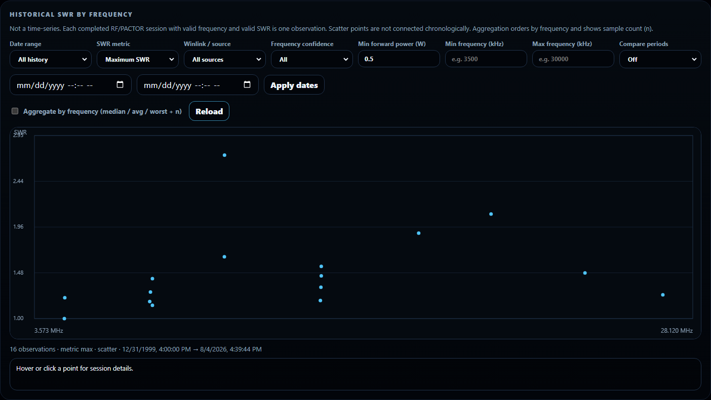
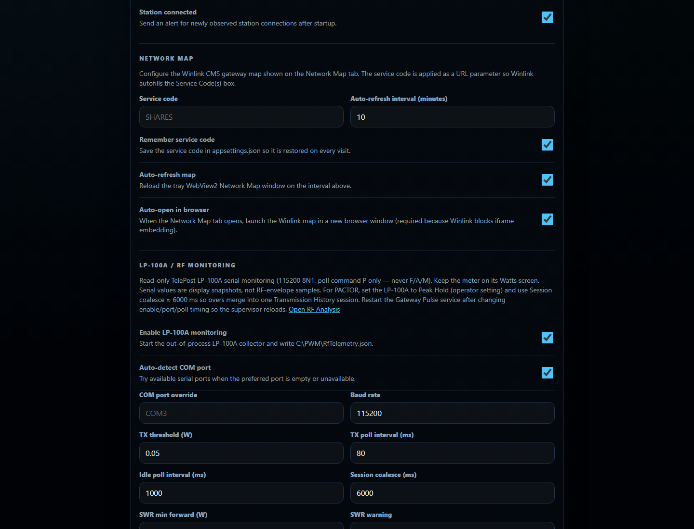

# Gateway Pulse v1.2 Multi-Device Power

Gateway Pulse is a read-only Windows monitoring dashboard for RMS Relay and RMS Trimode gateways. This line preserves Smart BatteryProtect integration and adds Victron SmartShunt Instant Readout plus TelePost LP-100A RF / SWR monitoring.

## Screenshots

### Dashboard — Station Power + RF Power



*Station overview with **Power System** (Victron) and **RF Power / SWR** (LP-100A) cards.*

### RF Power — Transmission History



*Live forward / reflected / SWR plus coalesced PACTOR and RF session history.*

### RF Analysis — Timeline



*Synchronized LP-100A power, peak, reflected (calculated), and SWR timeline for a transmission.*

### Historical SWR by Frequency



*Per-session SWR observations plotted by frequency (not a time series).*

### Settings — LP-100A / RF Monitoring



*LP-100A serial monitoring, session coalesce, and RF history settings. Network Map launcher is in the same Settings page / nav.*

## Projects

- `GatewayPulse.Core` — gateway monitoring, memory/log parsing, and Pushover
- `GatewayPulse.Service` — Windows Service, Kestrel API, dashboard, and collector supervision
- `GatewayPulse.Tray` — notification-area client
- `GatewayPulse.PowerMonitoring` — provider-neutral schema-v2 telemetry, composition, atomic JSON, and file reader
- `GatewayPulse.VictronMonitor` — shared BLE scanner, BatteryProtect/SmartShunt decoders, multi-device manager, scan/device/mock modes
- `GatewayPulse.RfMonitoring` — LP-100A telemetry, transmission history, RF analysis, and SWR-by-frequency stores
- `GatewayPulse.Lp100Monitor` — TelePost LP-100A serial collector (live + mock)
- `GatewayPulse.VictronMonitor.Tests` — protocol, provider, manager, configuration, API/file, supervisor, and dashboard-state tests

## Power + RF flow

```text
Victron BLE watcher -> VictronPowerManager
  -> C:\PWM\PowerTelemetry.json -> /api/power -> Power System card

LP-100A serial (or mock) -> RfTransmissionTracker / analysis stores
  -> C:\PWM\Rf*.json -> /api/rf* -> RF Power card, RF Analysis, SWR-by-frequency
```

Every Victron device has its own address and ACL-protected key file. Key values are never accepted as multi-device process arguments or emitted in telemetry, APIs, logs, or dashboard output.

## Local demo (isolated data)

Demo Mode hosts the dashboard with Victron + LP-100A mocks and writes under `C:\PWM\demo` (does not wipe production `C:\PWM\*.json`):

```powershell
# Seed demo JSON once from repo preview data, then:
powershell.exe -NoProfile -ExecutionPolicy Bypass -File .\.hermes\run-rf-ui-mockup.ps1
```

Open:

- Dashboard: http://127.0.0.1:8080/
- RF Analysis: http://127.0.0.1:8080/rf-analysis.html
- Network Map: http://127.0.0.1:8080/network-map.html
- Settings: http://127.0.0.1:8080/settings.html

## Canonical build

```powershell
powershell.exe -NoProfile -ExecutionPolicy Bypass -File .\build-installer.ps1
```

The build runs Release .NET tests, Power System JavaScript state tests, multi-device configuration/ACL tests, four self-contained Windows publishes (service, tray, Victron, LP-100A), and Inno Setup compilation. Output:

```text
Installer_Output\GatewayPulseSetup_v1.2.8.exe
```

## Documentation

- [`docs/POWER_MONITORING_ARCHITECTURE.md`](docs/POWER_MONITORING_ARCHITECTURE.md)
- [`docs/VICTRON_BLE_PROTOCOL.md`](docs/VICTRON_BLE_PROTOCOL.md)
- [`docs/GATEWAY_DEPLOYMENT.md`](docs/GATEWAY_DEPLOYMENT.md)
- [`GatewayPulse.VictronMonitor/README.md`](GatewayPulse.VictronMonitor/README.md)

Do not modify the live gateway until the v1.2 installer is fully built, hashed, and verified and the rollback backup has been captured.
